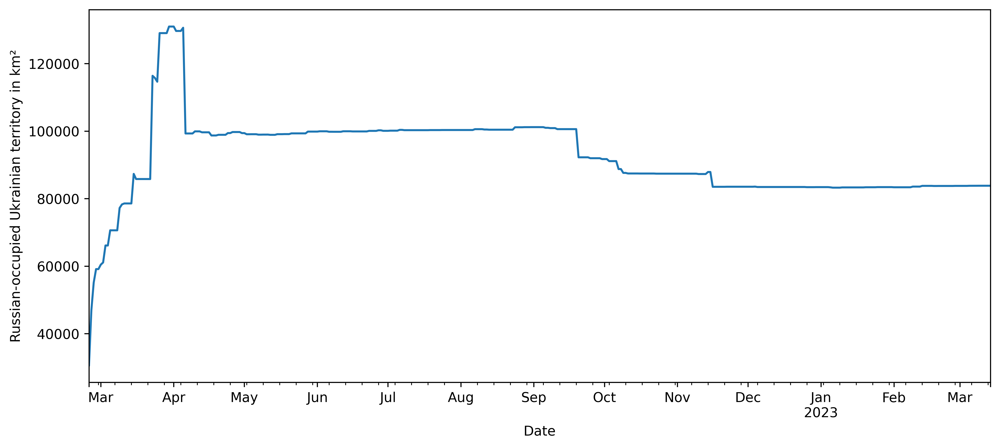
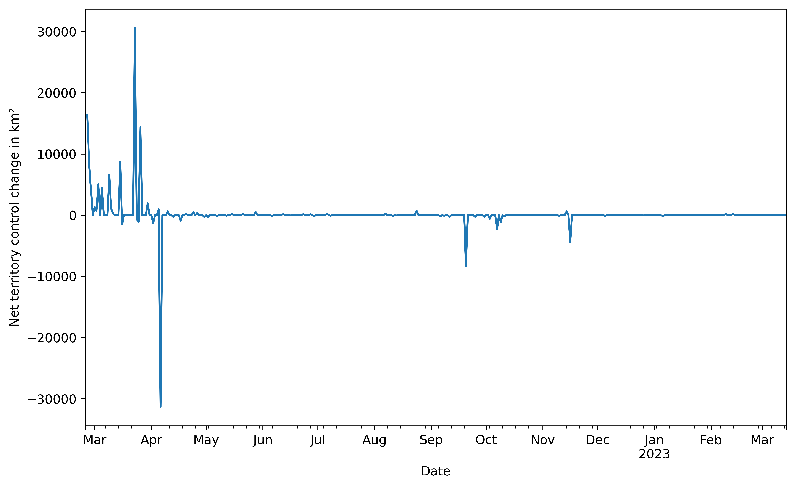

# Territory control via nzz.ch map

### Scraping the data

Run `python scrape.py`. The data is updated automatically via GitHub actions
once a day from nzz.ch.

Article: [Interactive map: How the Ukraine war is developing, day by day](https://www.nzz.ch/english/ukraine-war-interactive-map-of-the-current-front-line-ld.1688087)

Endpoints: Served from `q-server.st-cdn.nzz.ch` as base API server.

- [Example `getAreas` request](https://q-server.st-cdn.nzz.ch/tools/custom_code/endpoints/2484ed2804c37655aa53312284ef8f7f/getAreas?appendItemToPayload=c43940da317fdc578cf589dd9357512c&toolRuntimeConfig=%7B%22fileRequestBaseUrl%22%3A%22https%3A%2F%2Fq-server.st-cdn.nzz.ch%2Ffile%22%7D&to=2023-03-08)
- [Example `getBattalions` request](https://q-server.st-cdn.nzz.ch/tools/custom_code/endpoints/2484ed2804c37655aa53312284ef8f7f/getBattalions?appendItemToPayload=c43940da317fdc578cf589dd9357512c&toolRuntimeConfig=%7B%22fileRequestBaseUrl%22%3A%22https%3A%2F%2Fq-server.st-cdn.nzz.ch%2Ffile%22%7D&from=2023-03-06&to=2023-03-08)
- [Example `getAnnotations` request](https://q-server.st-cdn.nzz.ch/tools/custom_code/endpoints/2484ed2804c37655aa53312284ef8f7f/getAnnotations?appendItemToPayload=c43940da317fdc578cf589dd9357512c&toolRuntimeConfig=%7B%22fileRequestBaseUrl%22%3A%22https%3A%2F%2Fq-server.st-cdn.nzz.ch%2Ffile%22%7D&from=2023-03-06&to=2023-03-08&language=en)

### Analysis

See the accompanying ipython jupyter notebook

**Russian-occupied Ukrainian territory in km^2**

**Net territory control change in km²**

